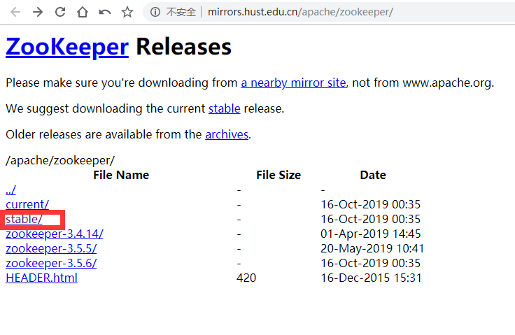

kafka13 + win10 安装配置
====

### 安装kafka之前需要先配置好JDK和zookeeper

JDK的安装配置
---

 #### 1. JDK下载地址：<https://www.oracle.com/technetwork/java/javase/downloads/jdk13-downloads-5672538.html>
   ##### 如下图（注意下载的文件有没有带 bin，没有的话会报错）：

   
 #### 2. 下载完成后直接安装，选择安装路径，记住路径，例如：D:\soft\JDK

   
 #### 3. 安装完成后需要使用 cmd 生成 jre文件。cmd跳转到jdk安装目录下，输入：

  ```shell script
bin\jlink.exe --module-path jmods --add-modules java.desktop --output jre
```

   
   
   ##### 此时JDK文件夹下会自动生成jre文件夹，里面就有所需要的依赖文件。

   
 #### 4. 配置环境变量
   ##### 右键 "我的电脑" -> "属性" -> "高级系统设置" -> "环境变量" -> 下方的 "系统变量"

   

   

  ##### 添加如下三个变量：

   

  ##### 此外还需要添加 Path 变量：
  
   
  
   

  ##### 添加完成后，所有窗口点击确定进行关闭，否则添加不成功
 #### 5. 重启 cmd ，输入 java -version 验证是否安装成功

   

zookeeper 的安装配置
---

 #### 1. 下载地址：<http://mirrors.hust.edu.cn/apache/zookeeper/>
   ##### 选择 stable 的版本，带 bin 的文件：

   

   ##### 点击进去，选择带 bin 的文件：
   
   
   
 #### 2. 解压到一个地址，例如： D:\soft\zookeeper，并且在其中新建一个 "data" 文件夹

   
   
 #### 3. 进入 conf 目录，复制“zoo_sample.cfg”，重命名为“zoo.cfg”
   
   ##### 编辑zoo.cfg
   
   ##### 找到并编辑 dataDir=D:\soft\zookeeper\data

   

  ##### 修改默认的Zookeeper端口（默认端口2181）
 #### 4. 添加系统环境变量：

  ##### 在系统变量中添加ZOOKEEPER_HOME

   

  ##### 编辑path系统变量，添加为路径%ZOOKEEPER_HOME%\bin

   
 #### 5. 关闭 cmd 重新打开，输入 zkserver，验证是否安装正确

   

kafka 安装配置
---

 #### 1. 下载地址：<http://kafka.apache.org/downloads.html>
   ##### 选择 Binary downloads 下面的版本:

   

   ##### 选择镜像下载：

   
   
 #### 2. 解压到一个文件夹，例如：D:\soft\kafka_2.12-2.3.1，并在其中新建一个文件夹为 "logs"

   
 #### 3. 进入config目录，编辑 server.properties文件，编辑log.dirs= D:\soft\kafka_2.12-2.3.1\logs，编辑zookeeper.connect=localhost:2181。表示本地运行。
   ##### (Kafka会按照默认，在9092端口上运行，并连接zookeeper的默认端口：2181)

   

   

   

##### 到此安装配置完成

启动服务
---

 #### 1. 首先启动 zookeeper: ```zkserver```，保持窗口不要关闭
 #### 2. 启动另一个 cmd，输入：
 
   ```.\bin\windows\kafka-server-start.bat .\config\server.properties```
  
  服务就运行起来了
 #### 3. 保持启动好的 zookeeper 和 kafka 服务，到安装目录下的 bin\windows\ 下打开另外的终端测试生产和消费
   ##### 先打开消费者 consumer：
   
   ```.\kafka-console-consumer.bat --bootstrap-server localhost:9092 --topic test0811  --from-beginning```
   
   ##### 再打开生产者 producer：
   
   ```.\kafka-console-producer.bat --broker-list localhost:9092 --topic test0811```
   
   ##### 在 producer 窗口下输入消息，consumer 会接收到并显示出来：
  
   


其他命令
===

 1. 完全删除topic
 
  - ##### 停止所有的生产和消费程序
  - ##### 在config/server.properties内增加:
   
     ```delete.topic.enable=true```
     
  - ##### 调用命令删除topic：
  
  ```./bin/kafka-topics --delete --zookeeper localhost:2181 --topic test001```
  
  - ##### 删除 logs 下所有的文件
  - ##### 在配置好 zookeeper 服务的主机上运行 zookeeper client:
  
  ```zkcli -server localhost:2181```
  
  - ##### 登陆到zk shell，然后找到topic所在的目录：```ls /brokers/topics```，找到要删除的topic，然后执行命令：
  
  ```rmr /brokers/topics/ test001```
  
  - ##### 如果是被 marked for deletion 的 topic ，则通过命令 ```ls /admin/delete_topics```，找到要删除的topic，然后执行命令：
  
  ```rmr /admin/delete_topics/ test001```
  
使用docker镜像运行 zookeeper 和 kafka
===

 ### 1. 搜寻下载docker hub上的 zookeeper 和 kafka:

   ```shell script
docker search zookeeper
```

   
   
   选择评分（stars）最高的 pull
 
   ```shell script
docker pull zookeeper
```
    
   
   
   同样搜索kafka 镜像列表，执行：
   
   ```docker search kafka```
    
   
   
   也是选评分最高的 pull 下来
   
   
   
 ### 2. 启动下载的镜像
    
   #### zookeeper 启动
    
   ```shell script
docker run --name zookeeper --restart always -d -p 2181:2181 zookeeper
```
    
   --name: 启动容器名称为 zookeeper

   --restart always: docker 重启时，zookeeper容器 会自动重启

   --d: 后台线程启动

   --p: 左边为容器外宿主机端口右边为容器内部zookeeper启动端口

   运行之后 能通过 docker ps  看到正在运行的容器
   
   #### kafka 启动:
   
   ```shell script
docker run  -d --name kafka -p 9092:9092 -e KAFKA_HEAP_OPTS="-Xmx512M -Xms265M" -e log.dirs=/logs/ -e KAFKA_BROKER_ID=0 -e KAFKA_ZOOKEEPER_CONNECT=192.168.1.3:2181 -e KAFKA_ADVERTISED_LISTENERS=PLAINTEXT://192.168.1.3:9092 -e KAFKA_LISTENERS=PLAINTEXT://0.0.0.0:9092 -t wurstmeister/kafka
```

   -e 是修改 kafka 相关参数，其中 KAFKA_ZOOKEEPER_CONNECT 和 KAFKA_ADVERTISED_LISTENERS 需要修改为宿主机的ip
   
   查看容器的相关日志
   
   ```shell script
docker logs -f -t --tail 200 039a0ff239ef37394c25294b2584a55eb5cb2d644ffe667433532be9af1fcf51  # （容器id）
```

   --tail 200 是指输出后200行
   
 ### 3. 进入运行中的容器：
 
```shell script
docker exec -it kafka /bin/bash   # 进入 kafka 容器
```

   
  
  kafka 在容器内的目录为 /opt/kafka_2.12-2.3.0/
  
 ### 4. 补充
 
   ##### 上述的docker镜像是基于 Alpine Linux 的，要定制或者在内部安装环境需要通过 apk 命令 (查看系统版本命令 ```cat /etc/issue```)
   
  - #### 先切换源（国内服务器）
   ```shell script
sed -i 's/dl-cdn.alpinelinux.org/mirrors.aliyun.com/g' /etc/apk/repositories  # 阿里镜像
# 或者
sed -i 's/dl-cdn.alpinelinux.org/mirrors.ustc.edu.cn/g' /etc/apk/repositories # 科大镜像
```
  - #### 通过 apk add 的方式安装包
  
  ```shell script
apk add python3
```

   

  - #### 也可以写在 Dockerfile 的 RUN 里，生成自己的镜像文件
   
  - #### 其他的 apk 命令：
```text
usage: apk COMMAND [-h|--help] [-p|--root DIR] [-X|--repository REPO] [-q|--quiet] [-v|--verbose] [-i|--interactive] [-V|--version] [-f|--force] [--force-binary-stdout] [--force-broken-world] [--force-non-repository] [--force-old-apk]
           [--force-overwrite] [--force-refresh] [-U|--update-cache] [--progress] [--progress-fd FD] [--no-progress] [--purge] [--allow-untrusted] [--wait TIME] [--keys-dir KEYSDIR] [--repositories-file REPOFILE] [--no-network]
           [--no-cache] [--cache-dir CACHEDIR] [--arch ARCH] [--print-arch] [ARGS]...

The following commands are available:
  add       Add PACKAGEs to 'world' and install (or upgrade) them, while ensuring that all dependencies are met
  del       Remove PACKAGEs from 'world' and uninstall them
  fix       Repair package or upgrade it without modifying main dependencies
  update    Update repository indexes from all remote repositories
  info      Give detailed information about PACKAGEs or repositories
  search    Search package by PATTERNs or by indexed dependencies
  upgrade   Upgrade currently installed packages to match repositories
  cache     Download missing PACKAGEs to cache and/or delete unneeded files from cache
  version   Compare package versions (in installed database vs. available) or do tests on literal version strings
  index     Create repository index file from FILEs
  fetch     Download PACKAGEs from global repositories to a local directory
  audit     Audit the directories for changes
  verify    Verify package integrity and signature
  dot       Generate graphviz graphs
  policy    Show repository policy for packages
  stats     Show statistics about repositories and installations
  manifest  Show checksums of package contents

Global options:
  -h, --help              Show generic help or applet specific help
  -p, --root DIR          Install packages to DIR
  -X, --repository REPO   Use packages from REPO
  -q, --quiet             Print less information
  -v, --verbose           Print more information (can be doubled)
  -i, --interactive       Ask confirmation for certain operations
  -V, --version           Print program version and exit
  -f, --force             Enable selected --force-* (deprecated)
  --force-binary-stdout   Continue even if binary data is to be output
  --force-broken-world    Continue even if 'world' cannot be satisfied
  --force-non-repository  Continue even if packages may be lost on reboot
  --force-old-apk         Continue even if packages use unsupported features
  --force-overwrite       Overwrite files in other packages
  --force-refresh         Do not use cached files (local or from proxy)
  -U, --update-cache      Update the repository cache
  --progress              Show a progress bar
  --progress-fd FD        Write progress to fd
  --no-progress           Disable progress bar even for TTYs
  --purge                 Delete also modified configuration files (pkg removal) and uninstalled packages from cache (cache clean)
  --allow-untrusted       Install packages with untrusted signature or no signature
  --wait TIME             Wait for TIME seconds to get an exclusive repository lock before failing
  --keys-dir KEYSDIR      Override directory of trusted keys
  --repositories-file REPOFILE Override repositories file
  --no-network            Do not use network (cache is still used)
  --no-cache              Do not use any local cache path
  --cache-dir CACHEDIR    Override cache directory
  --arch ARCH             Use architecture with --root
  --print-arch            Print default arch and exit

This apk has coffee making abilities.
```
